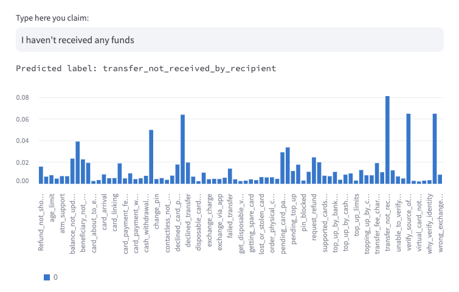

<p align="center">
  <a href="https://github.com/fabiogomez11c/llm_banking" ></a>
</p>

To run the project you should create a virtual environment and install the requirements.txt file.

```bash
pip install -r requirements.txt
```

Then you can run locally the project with the following command:

```bash
streamlit run main.py
```